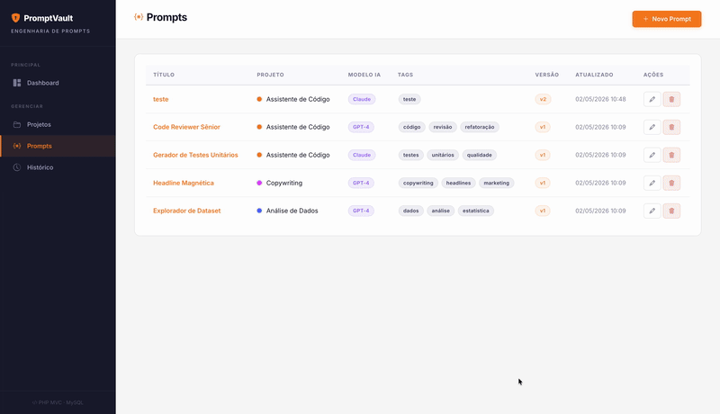

# PromptVault 🛡️ - Cofre de Engenharia de Prompts de IA

Projeto acadêmico desenvolvido em **PHP Puro**, focado na implementação rigorosa da arquitetura **MVC (Model-View-Controller)** e no gerenciamento de dados utilizando banco de dados **MySQL**.

## Design Inspirado na Cloudflare



## 📌 O que é o PromptVault?

Com a ascensão da Inteligência Artificial, gerenciar diferentes instruções (prompts) enviadas para ferramentas como GPT-4, Claude e Gemini tornou-se um desafio. O **PromptVault** atua como um repositório central para:
*   Organizar prompts por categoria/projeto.
*   Versionar alterações, mantendo o histórico exato (conteúdo anterior vs novo).
*   Facilitar a reutilização e o refinamento de instruções complexas.

## 🎓 Requisitos do Trabalho Acadêmico Atendidos

Este protótipo atende a todos os critérios estabelecidos para a disciplina:

1.  **Modelo MVC:** Arquitetura dividida em `app/models`, `app/views` e `app/controllers`, com um *Front Controller* (`index.php`) centralizando o roteamento.
2.  **Banco de Dados:** Conexão com MySQL utilizando a biblioteca `PDO` (PHP Data Objects), garantindo segurança contra *SQL Injection* via *Prepared Statements*.
3.  **CRUD (Create, Read, Update, Delete):**
    *   Implementado para **3 entidades (objetos) inter-relacionadas**:
        *   📁 **Projetos:** Agrupadores lógicos de prompts.
        *   ⚡ **Prompts:** As instruções em si (pertencem a um Projeto).
        *   🔄 **Histórico de Versões:** Registros automáticos gerados sempre que um Prompt é atualizado.
4.  **Em Duplas:** (Documente aqui sua dupla, se aplicável).
5.  **Tema e Layout Livres:** Escolhido um tema moderno (Engenharia de Prompts) com **UI Premium** estritamente inspirada no Design System oficial da **Cloudflare**.

## 🚀 Como Executar o Projeto

### Pré-requisitos
*   PHP 8.0 ou superior (com extensão PDO e pdo_mysql habilitadas).
*   Servidor MySQL.

### Passo 1: Banco de Dados
1. Crie um banco de dados vazio (ex: `cofre_prompts`).
2. Execute o script SQL localizado em `database/schema.sql` na sua ferramenta de banco de dados (phpMyAdmin, DBeaver, etc.) para criar as tabelas e inserir os dados iniciais.

### Passo 2: Configuração
No arquivo `config/db.php`, verifique se as credenciais do banco de dados (host, dbname, user, password) correspondem ao seu ambiente local.

```php
// config/db.php
$host = '127.0.0.1';
$dbname = 'cofre_prompts'; // ou o nome que você usou
$user = 'root'; // seu usuário
$pass = ''; // sua senha
```

### Passo 3: Iniciar o Servidor
Abra o terminal na pasta raiz do projeto (`TrabalhoWillen`) e inicie o servidor embutido do PHP:

```bash
php -S localhost:8000
```

Acesse no navegador: `http://localhost:8000`

## 🗂️ Estrutura de Pastas (MVC)

```text
/
├── app/
│   ├── controllers/      # Regras de negócio e intermediação
│   │   ├── BaseController.php
│   │   ├── DashboardController.php
│   │   ├── HistoricoController.php
│   │   ├── ProjetosController.php
│   │   └── PromptsController.php
│   ├── models/           # Persistência e comunicação com BD via PDO
│   │   ├── BaseModel.php
│   │   ├── HistoricoVersao.php
│   │   ├── Projeto.php
│   │   └── Prompt.php
│   └── views/            # Interface do Usuário (HTML/PHP mesclados)
│       ├── dashboard/
│       ├── errors/
│       ├── historico/
│       ├── layout/       # Componentes globais (header, footer)
│       ├── projetos/
│       └── prompts/
├── config/               # Arquivo de conexão do banco (db.php)
├── database/             # Script de criação do banco (schema.sql)
├── public/               # Assets estáticos (CSS, JS)
│   ├── css/
│   │   └── style.css     # UI Cloudflare-inspired completa
│   └── js/
│       └── app.js
├── index.php             # Ponto de Entrada (Front Controller / Roteador)
└── README.md
```

## 🎨 Decisões de Design (UI/UX)
O layout abandona o uso de *frameworks* CSS pesados no visual em favor de um **Vanilla CSS Customizado** com a estética corporativa da **Cloudflare**:
*   Modo claro primário com uma barra lateral em tom escuro contrastante (`#1b1b32`).
*   Uso inteligente de espaços em branco (padding) e tipografia legível (Fonte: *Inter*).
*   Botões de ação ("Call to Action") utilizando a identidade Laranja Cloudflare (`#f6821f`).
*   Feedback visual sutil via micro-animações, como tabelas com *hover state* e sombras em formulários ativos.
*   **Design 100% Responsivo**: Implementação de *Media Queries* fluidas e um menu *Hamburger* dinâmico (com *overlay* de fundo) que adapta a interface complexa de *dashboard* para dispositivos móveis sem comprometer a usabilidade.

## 🛡️ Segurança e Práticas Adotadas
*   **Encapsulamento SQL:** `BaseModel` generaliza queries com `prepare` e `execute`.
*   **Prevenção XSS:** Todo dado injetado nas *Views* passa por `htmlspecialchars()`.
*   **Tratamento de Exceções:** Conexão PDO envolvida em blocos `try/catch` para não vazar caminhos do sistema.
*   **Feedback ao Usuário:** Mensagens tipo Flash (salvas via Sessão) informam sucesso ou erro a cada ação do CRUD.
